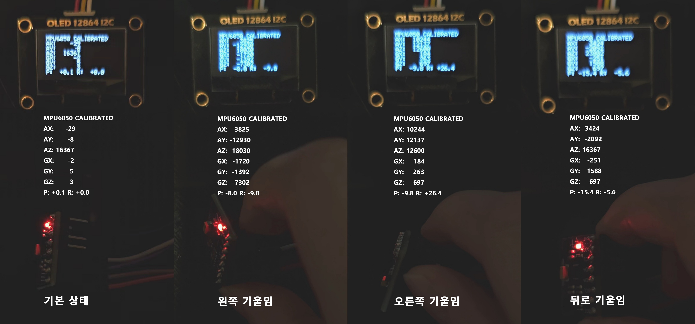
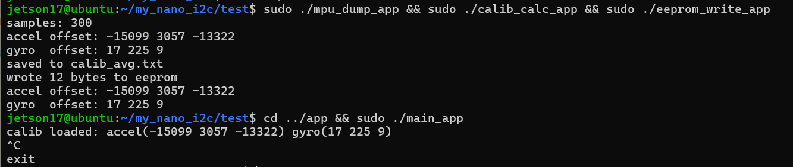
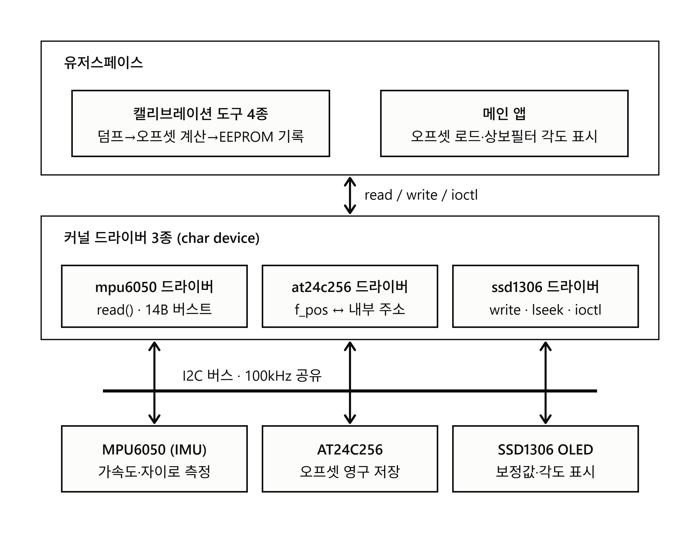

# jetson-i2c-drivers

**Jetson Nano에서 I2C 디바이스 3종(IMU·EEPROM·OLED)의 리눅스 커널 캐릭터 디바이스 드라이버를 작성하고, 센서 캘리브레이션 파이프라인으로 검증한 프로젝트**

센서 자체의 초기 바이어스(zero-offset)를 제거해야 안정적인 기울기 추정이 가능하다.
MPU6050의 정지 상태 샘플을 덤프해 평균 오프셋을 구하고 AT24C256 EEPROM에 영구 저장한다.
메인 앱은 기동 시 EEPROM에서 오프셋을 로드해 MPU6050 값을 실시간 보정한다.
상보필터로 구한 기울기 각도(PITCH/ROLL)와 함께 SSD1306 OLED에 표시한다.

디바이스 트리 오버레이, 커널 드라이버(char device), 유저스페이스 앱을 각각 작성했고,
캘리브레이션 파이프라인과 메인 앱 모두 실제 Jetson Nano에서 엔드투엔드 검증했다
(덤프 → 평균 → EEPROM 저장 → 콜드부트 후 유지 확인 → 실시간 보정 표시).

**기술 스택**: Linux Kernel Module, I2C(i2c_transfer/SMBus), Device Tree Overlay,
Character Device Driver, Embedded C, Jetson Nano(L4T), EEPROM, OLED


<p align="center">
  
</p>

<p align="center">
  <em>캘리브레이션이 적용됐을 때, 기울기에 따른 값 변화</em>
</p>

<p align="center">
  
</p>

<p align="center">
  <em>캘리브레이션 데이터 저장 및 불러오기</em>
</p>

<details>
<summary>구현 영상</summary>

<!-- TODO: video src에 업로드한 영상 URL(예: GitHub user-attachments/assets/...) 붙여넣기 -->
<p align="center">
  <video src="영상 URL" controls width="100%"></video>
</p>

<p align="center">
  <em>예: 캘리브레이션 파이프라인(덤프 → 평균 → EEPROM 저장) 이후 실시간 보정값과 PITCH/ROLL이 OLED에 표시되는 전체 동작</em>
</p>

</details>

## 시스템 구성

<p align="center">
  
</p>

<p align="center">
  <em>시스템 아키텍처</em>
</p>

| 디바이스 | 주소 | 역할 | 드라이버 인터페이스 |
|---|---|---|---|
| GY-521 (MPU6050 표기 — 실측 WHO_AM_I=0x70, 클론/MPU6500 계열 추정) | 0x68 | 가속도/자이로 | `read()` — 14B 버스트 → struct |
| AT24C256 | 0x50 | 캘리브레이션 영구 저장 | `read()`/`write()` — f_pos = 메모리 주소 |
| SSD1306 128x64 | 0x3C | 결과 표시 | `write()`(글자당 6B 비트맵) / `llseek` / `ioctl`(CLEAR) |

## 저장소 구성

```
├── driver/              # 커널 모듈 3종 (out-of-tree, Jetson에서 빌드)
│   ├── mpu6050_i2c.c    #   IMU 드라이버 (가속도/자이로 버스트 리드)
│   ├── at24c256_i2c.c   #   EEPROM 드라이버 (오프셋 영구 저장)
│   └── ssd1306_i2c.c    #   OLED 드라이버 (상태 텍스트 출력)
├── include/             # 커널·유저스페이스 공유 ABI 헤더 (구조체 레이아웃, ioctl 코드)
├── dts/                 # 디바이스 트리 오버레이 3종 (fdtoverlay로 베이스 DTB에 병합)
├── tools/               # 캘리브레이션 파이프라인 앱 4종 (단계별 검증)
└── app/                 # 메인 앱: EEPROM 로드 → 실시간 보정 + 각도 → OLED 표시
```

## 트러블슈팅 (커널 드라이버 개발 중)

이 하드웨어(Jetson Nano)·이 커널(L4T 4.9)에서만 겪을 수 있는 핵심 5건:

| # | 증상 | 원인 | 해결 |
|---|------|------|------|
| 1 | `insmod`는 성공했고 DT 매칭 조건도 전부 정상인데 probe가 호출조차 안 됨(로그 없음) | L4T 4.9의 `i2c_device_probe()`는 of_match 성공과 별개로 `id_table`이 NULL이면 -ENODEV를 반환한다. 이 조건은 최신 커널에는 없다. | 드라이버 3종 모두에 `i2c_device_id` 테이블을 추가했다. 테이블 내용은 쓰이지 않으며 NULL이 아니라는 점만 중요하다. |
| 2 | EEPROM write cycle 대기용 ACK 폴링(zero-length write)이 매번 EREMOTEIO로 실패. 타임아웃을 4배로 늘려도 동일 | Tegra I2C는 패킷 엔진이라 페이로드 길이를 "N-1"로 인코딩하며, 0바이트 자체를 표현할 수 없다. 메인라인 커널은 이를 `I2C_AQ_NO_ZERO_LEN` quirk로 공식화했지만 4.9에는 백포트되지 않았다. | `msleep(20)` 고정 딜레이 방식으로 되돌렸다. 이 플랫폼에서는 임시방편이 아니라 올바른 구현이다. |
| 3 | AT24C256의 2바이트 주소를 SMBus 래퍼로 표현할 수 없었고, MPU 버스트 리드도 래퍼 경로에서 반복 실패 | SMBus 래퍼는 "command 1바이트" 형식 전용이다. MPU 쪽 실패는 배선 개선 시점과 겹쳐 래퍼만이 원인이라고 단정하지는 않는다. | `i2c_transfer()` + `i2c_msg[]`를 직접 구성하는 방식으로 통일했다. |
| 4 | 잘 동작하던 기기 여러 개가 `i2cdetect`에서 동시에 사라졌다가 동시에 복귀 | 깨진 트랜잭션이 SDA를 붙잡는 버스 행(bus hang)이었다. 근본 원인은 브레드보드 신호 불안정이었다. | "동시 실패=공유 자원, 단독 실패=개별 배선" 진단 규칙을 세우고 점퍼를 단축했다. probe 재시도와 앱 스킵 방어 로직도 추가했다. |
| 5 | WHO_AM_I 값이 데이터시트 값(0x68)과 다름. 캘리브레이션 값도 비정상적 | GY-521 실칩이 클론이라 실측 WHO_AM_I가 0x70이었다. 캘리브레이션은 기울어진 자세에서 덤프해 발생했다. | 체크값을 실측 기준으로 수정했다. 저장 전 1g 벡터 검산을 도입했다. |

## 설계 노트

- **공유 ABI 헤더 (`include/`)**: `read()`/`write()`로 오가는 구조체 레이아웃과 ioctl 코드는
  커널과 유저스페이스가 같은 헤더를 include해 합의한다. `<linux/types.h>`의 `__s16`을 써서
  양쪽 모두 typedef 트릭 없이 동작.
- **디바이스 노드는 probe 성공 후 생성**: WHO_AM_I 검증(글리치 대비 재시도)과 센서 초기화가
  성공한 경우에만 `/dev` 노드가 존재 — 드라이버 생명주기를 실제 하드웨어 상태와 일치시킴.
- **노이즈 대책 2단 + 타이밍 파이프라인**: 칩 내장 DLPF(44Hz 대역폭)로 1차 필터링한 신호를
  20ms 간격 10샘플 평균(약 3.2배 노이즈 감소)으로 2차 필터링하고, 그 결과를 200ms(5Hz) 주기로
  OLED에 갱신한다. 필터 대역폭·샘플링 주기·표시 주기라는 세 시간축을 구분해 맞춘 구조다.
  DLPF는 센서 실리콘의 하드웨어 필터로, 커널이 계산하지 않는다.
- **자세 기준 캘리브레이션**: 실사용 자세에서 캘리브레이션해 중력 방향이 오프셋에 포함된다
  (baked-in) — 표시되는 각도는 "기준 자세 대비 상대 기울기"라는 것을 인지하고 쓰는 방식.
  저장 전 정지 상태 accel 벡터 크기 ≈ 1g(16384) 검산으로 잘못된 오프셋의 전파를 차단.
- **영구성 실증 구조**: EEPROM 쓰기 주체와 읽기 주체를 별도 프로세스로 분리하고 콜드부트
  후 재독출로 검증 — 같은 프로세스 안에서 쓰고 읽으면 캐시/변수값과 구분되지 않기 때문.

## 추후 개선 사항

이 프로젝트의 범위(폴링 기반 읽기)는 여기서 완결됐다. 아래는 범위 밖으로 판단해 남겨둔 것들이다:

- MPU6050 INT 핀 + 인터럽트/워크큐 기반 읽기
- 전역 캐시(g_cache) + mutex 동기화
- 모듈 자동 로드 (`/lib/modules` + `modules-load.d`)

<details>
<summary>빌드 & 실행</summary>

개발은 WSL2에서 하고 rsync로 동기화하며, 빌드는 전부 Jetson Nano 위에서 네이티브로 한다.
사전 준비: 오버레이 컴파일용 `device-tree-compiler`(dtc), 그리고 타겟 커널(4.9.337-tegra)과
정확히 일치하는 커널 헤더(`driver/Makefile`의 `KDIR`이 `/usr/src`의 해당 경로를 참조)가 필요하다.

### 1. 디바이스 트리 오버레이 (최초 1회)

```bash
cd dts
dtc -@ -O dtb -o mpu6050-overlay.dtbo mpu6050-overlay.dts     # x3
sudo fdtoverlay -i /boot/tegra210-p3448-0000-p3449-0000-b00.dtb \
    -o /boot/tegra210-nano-mycustom.dtb *.dtbo
# /boot/extlinux/extlinux.conf에 FDT 줄 포함한 새 부트 항목 추가 후 재부팅
ls /proc/device-tree/i2c@7000c400/    # mpu6050@68, at24c256@50, ssd1306@3c 확인
```

라즈베리파이(`config.txt`의 dtoverlay 자동 병합)와 달리, 젯슨(L4T 32.x)은 오버레이를
부트 전에 직접 병합해서 완성본 DTB를 부트로더에 지정해야 한다. `/boot/extlinux/extlinux.conf`의
원본 항목(`primary`)은 그대로 두고, 새 DTB를 가리키는 항목만 추가하는 방식으로 적용한다:

```
LABEL custom
      MENU LABEL custom kernel with i2c overlays
      LINUX /boot/Image
      INITRD /boot/initrd
      FDT /boot/tegra210-nano-mycustom.dtb
      APPEND ${cbootargs} quiet root=/dev/mmcblk0p1 rw rootwait rootfstype=ext4 console=ttyS0,115200n8 console=tty0 fbcon=map:0 net.ifnames=0
```

`DEFAULT`를 이 항목으로 바꾸되 `primary`는 지우지 않아서, 헤드리스(SSH 전용) 환경에서 오버레이가
잘못돼도 SD카드를 분리해 원본 설정으로 되돌릴 수 있는 복구 경로를 확보한 채로 재부팅했다.

### 2. 커널 드라이버

```bash
cd driver
make
sudo insmod mpu6050_i2c.ko && sudo insmod at24c256_i2c.ko && sudo insmod ssd1306_i2c.ko
ls /dev/mpu6050_i2c /dev/at24c256_i2c /dev/ssd1306_i2c
```

### 3. 캘리브레이션 파이프라인

센서를 실사용 자세로 고정한 뒤 순서대로 실행한다:

```bash
cd tools && make
sudo ./mpu_dump_app          # 1. 300샘플 덤프 → mpu_dump.txt
sudo ./calib_calc_app        # 2. 평균 오프셋 계산 → calib_avg.txt
sudo ./eeprom_write_app      # 3. EEPROM에 영구 저장
sudo ./eeprom_read_oled_app  # 4. 재독출 + OLED 표시로 검증
```

쓰기와 읽기를 별도 프로세스로 분리해 EEPROM 영구 저장을 실증하는 구조 — 콜드부트 후에도 유지 확인 완료.

### 4. 메인 앱

```bash
cd app && make
sudo ./main_app    # EEPROM 오프셋 로드 → 5Hz로 보정값 + PITCH/ROLL 표시, Ctrl+C 종료
```

</details>
